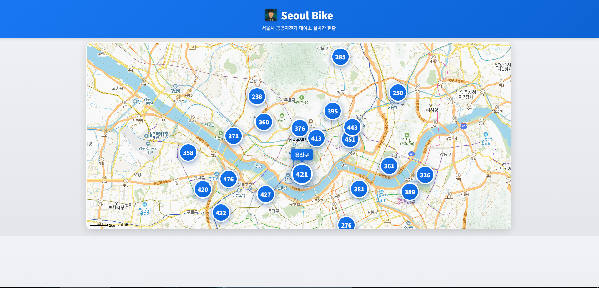
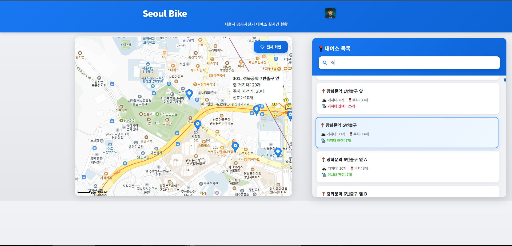
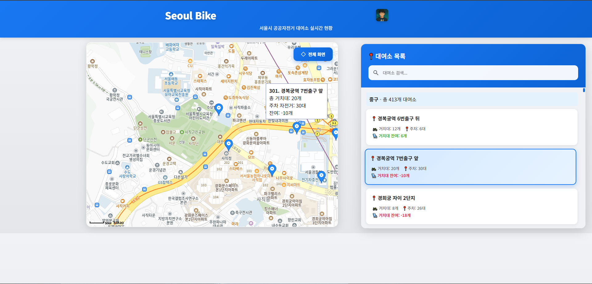

# 🚴 Seoul Bike - 서울 자전거 대여소 실시간 현황

## Vercel을 이용해 배포 Click! ➡️ [](https://seoul-bike-rental-service.vercel.app/)

### 서울시 공공자전거(따릉이) 대여소의 실시간 현황을 지도에서 확인할 수 있는 웹 애플리케이션입니다.


## ✨ 주요 기능

- **📍 지도 기반 시각화**: Kakao Maps API를 활용한 직관적인 지도 인터페이스
- **🎯 클러스터링**: 서울시 25개 자치구별로 대여소를 그룹화하여 표시


- **🔍 실시간 검색**: 대여소 이름으로 빠른 검색 가능


- **📱 반응형 디자인**: 데스크톱과 모바일 모두 지원
- **💺 실시간 정보**: 각 대여소의 거치대 수, 주차된 자전거 수, 잔여 거치대 수 실시간 확인


## 🛠️ 기술 스택

- **Frontend**: HTML5, CSS3, Vanilla JavaScript
- **Maps API**: Kakao Maps JavaScript API
- **Data Source**: 서울시 열린 데이터 광장 API

## 📦 프로젝트 구조
```
seoul-bike/
├── index.html          # 메인 HTML 파일
├── app.js             # 애플리케이션 로직
├── style.css          # 스타일시트
└── icon.ico           # 파비콘/로고 이미지
```

## 🚀 시작하기

### 1. 프로젝트 클론
```bash
git clone [repository-url]
cd seoul-bike
```

### 2. API 키 설정

프로젝트를 실행하기 전에 다음 API 키들을 설정해야 합니다:

#### Kakao Maps API 키
1. [Kakao Developers](https://developers.kakao.com/)에서 애플리케이션 생성
2. `index.html` 파일의 다음 부분에 본인의 API 키 입력:
```html
<script src="//dapi.kakao.com/v2/maps/sdk.js?appkey=YOUR_KAKAO_API_KEY"></script>
```

#### 서울시 공공 API 키
1. [서울 열린데이터광장](https://data.seoul.go.kr/)에서 회원가입
2. 공공자전거 실시간 대여정보 API 신청
3. `app.js` 파일의 `apiKey` 변수에 본인의 API 키 입력:
```javascript
const apiKey = "YOUR_SEOUL_API_KEY";
```

### 3. 실행

로컬 서버를 실행하여 프로젝트를 확인할 수 있습니다:
```bash
# Live Server (VS Code Extension) 사용
# 또는
python -m http.server 8000
# 또는
npx serve
```

브라우저에서 `http://localhost:8000` 접속

## 💡 사용 방법

1. **지도 확인**: 페이지 로드 시 서울시 전체 지도와 각 구별 클러스터 마커가 표시됩니다
2. **클러스터 클릭**: 원하는 구의 클러스터를 클릭하면 해당 구역의 대여소 목록이 사이드바에 표시됩니다
3. **대여소 검색**: 사이드바 상단의 검색창에서 대여소 이름으로 검색할 수 있습니다
4. **상세 정보 확인**: 대여소를 클릭하면 지도가 해당 위치로 이동하며 상세 정보가 표시됩니다
5. **전체 화면**: 우측 상단의 "전체 화면" 버튼을 클릭하면 초기 화면으로 돌아갑니다

## 📊 데이터 정보

- **데이터 출처**: 서울시 열린데이터광장 - 공공자전거 실시간 대여정보
- **총 대여소 수**: 약 2,741개 (2024년 기준)
- **업데이트 주기**: 실시간

## 🎨 주요 특징

### 클러스터링 시스템
- 서울시 25개 자치구를 기준으로 대여소를 그룹화
- 각 클러스터는 해당 구역의 대여소 개수를 표시
- 호버 시 구 이름이 표시되는 인터랙티브한 디자인

### 반응형 디자인
- 데스크톱: 지도 60% + 사이드바 40% 레이아웃
- 모바일: 전체 화면 지도 + 하단 슬라이드 사이드바

### 부드러운 애니메이션
- 사이드바 슬라이드 애니메이션
- 마커 호버 효과
- 리스트 아이템 선택 효과

### 검색 반경 조정
`app.js`의 `radius` 값을 수정하여 검색 반경을 조정할 수 있습니다:
```javascript
const radius = 0.05; // 약 5km 반경
```

## 📧 문의

프로젝트에 대한 문의사항이 있으시면 이슈를 등록해주세요.

## 🙏 감사의 말

- [Kakao Maps API](https://apis.map.kakao.com/)
- [서울 열린데이터광장](https://data.seoul.go.kr/)
- [Google Fonts](https://fonts.google.com/)
